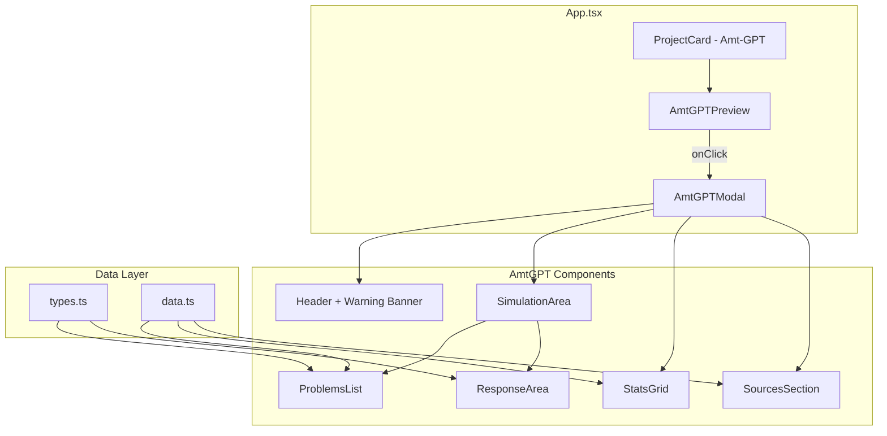

# Amt-GPT Integration Plan

## Overview

**Project:** Integrate Amt-GPT satirical simulator into portfolio website  
**Approach:** Embedded preview with modal for full experience  
**Status:** Ready for Implementation

---

## Component Architecture



---

## File Structure

```
src/components/AmtGPT/
├── index.ts                 # Barrel exports
├── types.ts                 # TypeScript interfaces
├── data.ts                  # Problems, stats, sources data
├── AmtGPTPreview.tsx        # Mini-preview for project card
├── AmtGPTModal.tsx          # Full modal experience
├── AmtGPTSimulator.tsx      # Core simulator logic
└── AmtGPT.css               # Component styles
```

---

## TypeScript Interfaces

```typescript
// types.ts

export type Severity = 'CRITICAL' | 'HIGH' | 'MEDIUM';

export interface Problem {
  id: string;
  title: string;           // e.g., "❌ Passwort vergessen"
  response: string;        // Bot's satirical response
  reason: string;          // Technical cause explanation
  severity: Severity;
  tags: string[];          // e.g., ["Authentication", "Medienbruch"]
}

export interface Stat {
  value: string;           // e.g., "60%"
  label: string;           // e.g., "Nicht-Inanspruchnahme"
}

export interface Source {
  badge: string;           // e.g., "Behörde", "Akademie"
  title: string;           // e.g., "Bundesrechnungshof (2025)"
  description: string;     // Full source description
}
```

---

## Data Extraction (from HTML)

### Problems Array (10 items)

```typescript
// data.ts

export const problems: Problem[] = [
  {
    id: "password",
    title: "❌ Passwort vergessen",
    response: "Wir senden Ihnen einen PIN-Brief per Post. Erwarten Sie die Zustellung in 5–7 Werktagen.",
    reason: "Fehlender E-Mail-Reset-Flow; nur PIN-Brief-Erzwingung als 'Sicherheits'-Übertrieb",
    severity: "HIGH",
    tags: ["Authentication", "Medienbruch"]
  },
  {
    id: "upload",
    title: "📁 Upload bricht ab (2,1 MB Datei)",
    response: "Ihre Datei ist mit 2,1 MB zu groß. Unser Mainframe benötigt Entschlackung. Maximale Größe: 2,0 MB.",
    reason: "2 MB Hard-Limit aus COBOL-Legacy (40 Jahre alt), Array-Größe ist fest kompiliert",
    severity: "MEDIUM",
    tags: ["Technical Debt", "COBOL"]
  },
  {
    id: "timeout",
    title: "⏰ Sitzung abgestürzt (nach 5 Min)",
    response: "Die 5-Minuten-Meditation war erfolgreich. Ihre Daten wurden zum Schutz gelöscht. Bitte starten Sie von vorne.",
    reason: "5-Minuten Session-Timeout ohne Auto-Save oder Vorwarnung; bei komplexen Anträgen führt dies zu Abbruch",
    severity: "CRITICAL",
    tags: ["Session Management", "UX"]
  },
  {
    id: "bundid",
    title: "🔐 BundID: 'Technischer Fehler'",
    response: "Verbindung zu 127.0.0.1:24727 fehlgeschlagen. Haben Sie die AusweisApp2 auf Ihrem PC installiert? Zwei Geräte nötig.",
    reason: "BundID-Architektur erfordert lokale Kommunikation zwischen Smartphone & PC; Browser-Inkompatibilität, Firewall-Probleme",
    severity: "CRITICAL",
    tags: ["BundID", "Authentication"]
  },
  {
    id: "matching",
    title: "🤔 Warum 'Kindergarten-Betreuung'?",
    response: "Unser DKZ-Katalog hat 'Python' als 'Tierpflege' klassifiziert. Bewerben Sie sich im Zoo. Ablehnung = Sanktionsrisiko.",
    reason: "Algorithmic Mismatch durch Keyword-Wildcard-Assoziationen; keine Zumutbarkeitsprüfung vor Vermittlungsvorschlag",
    severity: "CRITICAL",
    tags: ["Matching-Bug", "DKZ"]
  },
  {
    id: "phone",
    title: "☎️ Ich habe Angst vor Telefonaten",
    response: "Das ist ein Problem mit Ihnen. Die Hotline erreichen Sie unter XXXX-XXXX (unterdrückte Nummer). Gerne rufen wir Sie an.",
    reason: "Telefon ist erzwungene Lösung; Viele Sachbearbeiter rufen aus Home-Office mit unterdrückter Nummer an; Phone Anxiety wird ignoriert",
    severity: "CRITICAL",
    tags: ["Phone Anxiety", "Sludge Design"]
  },
  {
    id: "weekend",
    title: "📴 Website offline am Wochenende",
    response: "Freitag 18:00 bis Montag 06:00: Wartung für nächtliche Batch-Läufe. COBOL-Mainframe braucht Schlaf.",
    reason: "Batch-Processing-Architektur; nächtliche Synchronisation; keine Redundanz oder 24/7-Verfügbarkeit",
    severity: "MEDIUM",
    tags: ["Batch Processing", "Availability"]
  },
  {
    id: "german",
    title: "📝 12-seitiges Formular, schwache Deutschkenntnisse",
    response: "'Mitwirkungspflichten', 'Eingliederungsverwaltungsakt', 'Zumutbarkeitsprüfung' – das ist Deutsch. Bitte rufen Sie an.",
    reason: "Behördendeutsch als bewusste Sludge-Strategie zur Reduktion der Inanspruchnahme",
    severity: "HIGH",
    tags: ["Sludge Design", "Complexity"]
  },
  {
    id: "outage",
    title: "💥 Rechenzentrum komplett offline",
    response: "Rechenzentren waren übergelastet. Keine Notstrom. Kein Failover. Sie sind selbst schuld.",
    reason: "Einzelnes Rechenzentrum ohne Redundanz; Bundesrechnungshof: Nur 10% erfüllen BSI-Mindeststandard",
    severity: "CRITICAL",
    tags: ["Infrastructure", "Redundancy"]
  },
  {
    id: "sync",
    title: "📊 Änderung sichtbar erst nach 48h",
    response: "Ihre Online-Eingabe wird erst in der nächtlichen Batch um 22:00 synchronisiert. Sachbearbeiter sieht es dann Montag.",
    reason: "VerBIS Batch-Processing mit 24-48h Latenz; asynchrone Web→Mainframe & Mainframe→Web Sync",
    severity: "HIGH",
    tags: ["Batch Processing", "Sync"]
  }
];
```

### Stats Array (4 items)

```typescript
export const stats: Stat[] = [
  { value: "60%", label: "Nicht-Inanspruchnahme (Grundsicherung)" },
  { value: "5 Min", label: "Session-Timeout" },
  { value: "2 MB", label: "Max. Datei-Upload" },
  { value: "40+ Jahre", label: "COBOL-Legacy" }
];
```

### Sources Array (6 items)

```typescript
export const sources: Source[] = [
  { 
    badge: "Behörde", 
    title: "Bundesrechnungshof (2025)", 
    description: "Verwaltungsdigitalisierung: Empfehlungen für die 21. Legislaturperiode – Kritik an fehlender IT-Redundanz, Session-Timeout-Problemen, Datenverwaltung" 
  },
  { 
    badge: "Akademie", 
    title: "Herd & Moynihan (2022)", 
    description: "Administrative Burden Framework – Learning, Compliance, Psychological Costs" 
  },
  { 
    badge: "Forschung", 
    title: "Sievert & Bruder (2024)", 
    description: "Administrative Burden and Policy Perceptions – Deutsches Fallstudie zu Arbeitslosengeld" 
  },
  { 
    badge: "Institut", 
    title: "WSI / Kaps (2023)", 
    description: "Digitalisierung in der Bundesagentur für Arbeit – VerBIS, Batch-Processing-Architektur" 
  },
  { 
    badge: "Technik", 
    title: "AusweisApp FAQ & BundID Support", 
    description: "127.0.0.1:24727 Fehler, Browser-Inkompatibilität, lokale Authentifizierungsprobleme" 
  },
  { 
    badge: "Nutzer", 
    title: "Reddit, Trustpilot, Foren", 
    description: "Session-Timeout-Beschwerden, Upload-Limit-Frustration, Phone-Anxiety-Berichte" 
  }
];
```

---

## Component Implementation Details

### 1. AmtGPTPreview.tsx

**Purpose:** Mini-preview shown inside the project card

```tsx
// Shows:
// - "🤖 Amt-GPT" title
// - Animated robot icon
// - "Starten" button to open modal
// - Optional: rotating problem preview

interface AmtGPTPreviewProps {
  onClick: () => void;
}
```

**Visual Design:**
- Dark background matching project card style
- Pulsing robot emoji or icon
- Hover effect reveals "Starten" button
- Height: ~150px (matching other project card previews)

### 2. AmtGPTModal.tsx

**Purpose:** Full-screen modal with the complete simulator

```tsx
interface AmtGPTModalProps {
  isOpen: boolean;
  onClose: () => void;
}
```

**Features:**
- Framer Motion animations (slide-up, fade)
- Backdrop blur and click-to-close
- Close button (X) in corner
- ESC key to close
- Scrollable content for mobile
- Full simulator inside

### 3. AmtGPTSimulator.tsx

**Purpose:** Core simulator logic and UI

**State:**
```tsx
const [selectedProblem, setSelectedProblem] = useState<Problem | null>(null);
```

**Sections:**
1. **Header** - Title + satire warning banner
2. **SimulationArea** - Two-column grid
   - Left: ProblemsList (clickable buttons)
   - Right: ResponseArea (bot response + technical reason)
3. **StatsGrid** - Four stat cards
4. **SourcesSection** - Collapsible or scrollable sources list

---

## Styling Strategy

### Use Portfolio CSS Variables

```css
/* AmtGPT.css */

.amt-gpt-container {
  --amt-primary: var(--accent-color);
  --amt-bg: var(--bg-card);
  --amt-border: var(--border-color);
  --amt-text: var(--text-primary);
  --amt-text-secondary: var(--text-secondary);
}

/* Severity colors */
.severity-critical { background: #c00000; color: white; }
.severity-high { background: #a84900; color: white; }
.severity-medium { background: #4a90e2; color: white; }
```

### Responsive Breakpoints

```css
/* Desktop: Two-column layout */
@media (min-width: 768px) {
  .simulation-area { grid-template-columns: 1fr 1fr; }
}

/* Mobile: Stack vertically */
@media (max-width: 767px) {
  .simulation-area { grid-template-columns: 1fr; }
}
```

---

## Integration in App.tsx

### Location: After existing project cards (line ~730)

```tsx
// Import at top
import { AmtGPTPreview, AmtGPTModal } from './components/AmtGPT';

// Inside App component, add state
const [isAmtGPTOpen, setIsAmtGPTOpen] = useState(false);

// In projects section, add new card
<ProjectCard
  title="Amt-GPT"
  role="UX Research & Satire"
  desc="Satirischer Chatbot der Bundesagentur für Arbeit. Visualisiert 'Administrative Burden' und Technical Debt durch passiv-aggressive Antworten basierend auf echten Systemfehlern."
  tech={['React', 'TypeScript', 'UX Research', 'Satire']}
>
  <AmtGPTPreview onClick={() => setIsAmtGPTOpen(true)} />
</ProjectCard>

// At end of App, add modal
<AmtGPTModal 
  isOpen={isAmtGPTOpen} 
  onClose={() => setIsAmtGPTOpen(false)} 
/>
```

---

## Implementation Order

1. **Create folder structure** `src/components/AmtGPT/`
2. **Create types.ts** with interfaces
3. **Create data.ts** with extracted problems/stats/sources
4. **Create AmtGPTSimulator.tsx** (core logic)
5. **Create AmtGPT.css** (styling)
6. **Create AmtGPTModal.tsx** (wrapper with animations)
7. **Create AmtGPTPreview.tsx** (card preview)
8. **Create index.ts** (barrel exports)
9. **Update App.tsx** (add project card + modal)
10. **Test** all functionality

---

## Acceptance Criteria

- [ ] Project card displays with preview animation
- [ ] Clicking preview opens modal with smooth animation
- [ ] All 10 problems selectable and display correct responses
- [ ] Severity badges colored correctly (CRITICAL/HIGH/MEDIUM)
- [ ] Stats grid shows all 4 metrics
- [ ] Sources section visible and readable
- [ ] Modal closes via X button, backdrop click, and ESC key
- [ ] Responsive on mobile (single column layout)
- [ ] Matches portfolio theme (respects CSS variables)
- [ ] No console errors or TypeScript warnings

---

## Notes

- The PNG images (ba_problems_chart.png, system_architecture.png) are optional enhancements
- The satirical tone must be preserved exactly as in the original
- Sources provide legitimacy - keep the academic references visible
- Consider adding keyboard navigation for accessibility

---

**Plan Created:** 2026-01-02  
**Ready for:** Code Mode Implementation